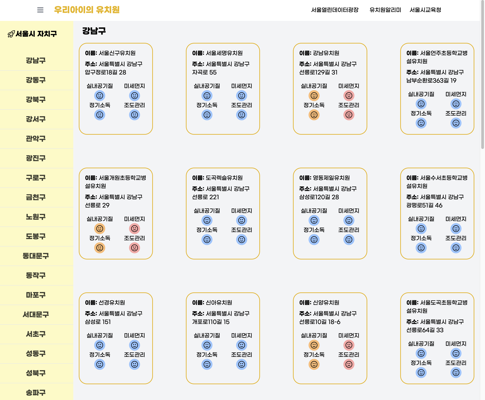
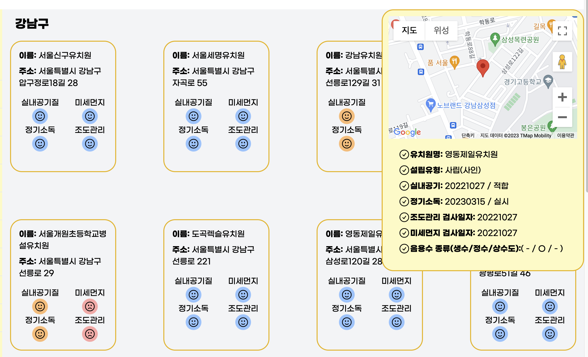

## 👦🏻💛 **우리 아이가 다닐건데, 유치원도 알아보고 보내야지!** 💛👧🏻 🫧
### 🚀 서울열린데이터광장 공모전 '**우리아이의 유치원**'
<br />

<p align="center">


</p>

<hr />

## **'우리아이의 유치원' 서비스 바로가기**
👉🏻 **임시 서비스 URL** : http://kinder.tosel.co.kr/
<br /><br /><br />


# **Useage**
### **🌏 지도**


- 각 자치구별로 다른 색깔이 배정되어 있는데, 각 자치구를 클릭하면 해당 자치구의 유치원 리스트를 확인할 수 있다.

<br /><br />
### **👧🏻 유치원 리스트**


- 유치원 리스트에는 각 유치원 마다 하나의 블록으로 구성 되어져 있다. 
- 그 블록에는 유치원 위생환경 상태를 알아보기 쉽게 하기 위하여 대분류마다 색을 부여하였다.

<br /><br />
### **🧐 유치원 세부사항**


- 그리고 각 유치원 블록을 클릭하면 위의 그림처럼 유치원 세부사항(유치원 위치, 유치원 정보, 환경 위생 관리 점검 사항)들이 나오게 된다.
- 이 정보들을 통해 해당 유치원의 환경 위생 상태 현황들을 잘 파악할 수 있다.


<br /><br />

# 🎨 **Front-End 사용 기술 스택**

<p align="center">

|<i>**🧑🏻‍💻 Stack**</i>|<i>**🧑🏻‍💻 Version**</i>|
|------|-----|
|Next.js|`13.3.3`|
|TypeScript|`5.0.4`|
|TailwindCSS|`3.3.2`|
|Mapbox-gl-geocoder|`4.7.3`|
|Mapbox-gl API|`2.7.11`|
|서울열린데이터광장 API|`-`|
|Google-Maps API|`2.18.1`|

</p>
<br />
<hr />
<br /><br />

# **📁 디렉토리 구조**

```shell
.
├── public
│   ├── fonts
│   └── img
└── src
    ├── assets
    ├── components
    ├── interfaces
    ├── pages
    ├── styles
    └── utils
```

<br><br>

# **Test**
```shell
git clone https://github.com/clean-kinder cleankinder-front.git
```
> '우리아이의 유치원' 로컬 테스트를 진행하기 위해선 Mapbox api 등록, Google Map api 등록, 서울열린데이터광장 api 등록이 필요합니다.

```text
# .env file
NEXT_PUBLIC_MAPBOX_TOKEN = "여기에 키를 넣으세요"
NEXT_PUBLIC_GOOGEL_MAP_KEY = "여기에 키를 넣으세요"
NEXT_PUBLIC_SEOUL_KEY = "여기에 키를 넣으세요"
NEXT_PULBIC_KINERLIST_KEY = "여기에 키를 넣으세요"
```

### **빌드, 실행하기**

```shell
npm run dev
or
npm start
```

<br><br>